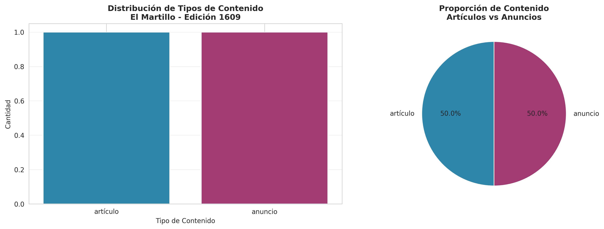
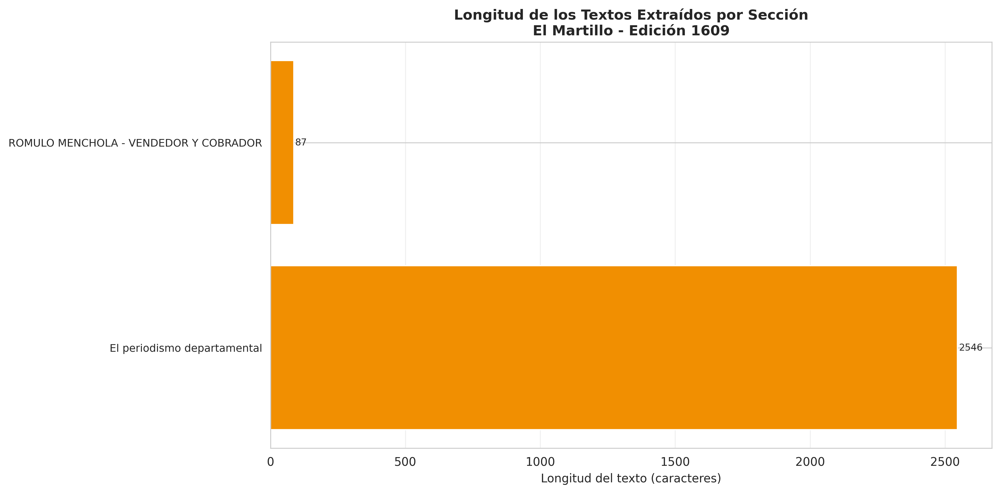

# 📰 El Martillo - OCR y Análisis Digital

> Digitalización y análisis de periódico histórico peruano usando Claude Vision API

[](https://www.python.org/downloads/)
[](https://www.anthropic.com/)
[](LICENSE)

---

## 📖 Descripción

Este proyecto utiliza la **API de Claude (visión/OCR)** de Anthropic para digitalizar y analizar páginas del periódico histórico peruano **"El Martillo"** (Chiclayo, 1903-1919). El objetivo es transformar documentos históricos escaneados en datos estructurados que faciliten su análisis, preservación y accesibilidad.

### 🎯 Página Analizada

- **Periódico**: El Martillo
- **Edición**: Número 1609
- **Fecha**: 5 de agosto de 1916
- **Ubicación**: Chiclayo, Lambayeque, Perú
- **Tema principal**: Historia del periodismo departamental en Lambayeque

---

## 🗂️ Estructura del Repositorio

```
el-martillo-ocr/
├── README.md                          # Este archivo
├── INFORME.md                         # Informe detallado del análisis
├── process_ocr.py                     # Script principal de procesamiento
├── el_martillo_ocr.ipynb             # Notebook Jupyter con análisis OCR
├── generate_visualizations.py         # Script para generar gráficos
├── requirements.txt                   # Dependencias de Python
├── data/
│   └── el_martillo/
│       ├── page_01.png                      # Imagen de la página escaneada (colocar aquí)
│       ├── page_info.txt                    # Información de la página
│       ├── texto_completo_extraido.txt      # Texto completo extraído (OCR)
│       ├── el_martillo_1609_structured.json # Datos estructurados en JSON (NUEVO)
│       ├── el_martillo_1609_structured.csv  # Datos estructurados en CSV
│       ├── visualization_content_distribution.png
│       ├── visualization_text_lengths.png
│       └── visualization_statistics.png
└── .gitignore
```

---

## 🚀 Inicio Rápido

### Prerrequisitos

- Python 3.8 o superior
- API Key de Anthropic Claude
- Git

### Instalación

1. **Clonar el repositorio**:
   ```bash
   git clone https://github.com/tu-usuario/el-martillo-ocr.git
   cd el-martillo-ocr
   ```

2. **Instalar dependencias**:
   ```bash
   pip install -r requirements.txt
   ```

3. **Configurar API Key de Claude**:
   ```bash
   export ANTHROPIC_API_KEY='tu-api-key-aquí'
   ```

4. **Colocar la imagen del periódico** (opcional):
   - Descarga la página escaneada de [Fuentes Históricas del Perú](https://fuenteshistoricasdelperu.com/2020/12/06/el-martillo-chiclayo-1903-1919/)
   - Guárdala como: `data/el_martillo/page_01.png`
   - Si no tienes la imagen, el script usará texto de ejemplo

5. **Ejecutar el análisis** (dos opciones):

   **Opción A - Script automatizado (RECOMENDADO):**
   ```bash
   python3 process_ocr.py
   ```

   Este script ejecuta el flujo completo **automático**:
   - 1️⃣ Extrae texto con OCR → `texto_completo_extraido.txt`
   - 2️⃣ Estructura datos con IA → `el_martillo_1609_structured.json` + `.csv`
   - 3️⃣ Crea visualizaciones → archivos `.png`

   **Opción B - Notebook Jupyter (interactivo):**
   ```bash
   jupyter notebook el_martillo_ocr.ipynb
   ```

---

## 🔄 Flujo de Procesamiento

El script `process_ocr.py` sigue un flujo **completamente automático** en 3 pasos:

### 📝 Paso 1: Extracción de Texto (OCR)
- Lee la imagen del periódico con **Claude Vision API**
- Extrae **todo el texto** de forma completa y precisa
- Guarda el resultado en: `data/el_martillo/texto_completo_extraido.txt`
- Formato: Texto plano con encabezados y estructura original

### 🤖 Paso 2: Estructuración Automática con IA
**NUEVO: Proceso 100% automático usando Claude API**

- ✨ Analiza el texto extraído con **Claude AI**
- 🧠 Identifica automáticamente:
  - Artículos y sus títulos
  - Secciones del periódico
  - Autores mencionados
  - Anuncios publicitarios
  - Metadata (fecha, edición, ubicación)
- 📦 Genera **dos formatos de salida**:
  - **JSON estructurado**: `data/el_martillo/el_martillo_1609_structured.json`
  - **CSV normalizado**: `data/el_martillo/el_martillo_1609_structured.csv`

**Modo Fallback**: Si no hay API key configurada, usa análisis de patrones básicos (regex) para generar la estructura automáticamente.

### 📈 Paso 3: Visualizaciones
- Lee el CSV generado
- Crea 3 gráficos de análisis:
  - 📊 Distribución de contenido (barras + circular)
  - 📏 Longitud de textos por sección
  - 📈 Estadísticas generales
- Guarda en: `data/el_martillo/visualization_*.png`

**Ventajas de este flujo:**
- ✅ **100% automático** - Sin intervención manual
- ✅ Primero texto completo, luego análisis estructurado
- ✅ Separación clara de responsabilidades
- ✅ Genera JSON y CSV para máxima flexibilidad
- ✅ Fácil de automatizar para múltiples páginas
- ✅ Permite verificar cada paso del proceso

---

## 📊 Datos Estructurados

El proyecto genera un archivo CSV con los siguientes campos:

| Campo         | Descripción                                    |
|---------------|------------------------------------------------|
| `date`        | Fecha de publicación (YYYY-MM-DD)             |
| `issue_number`| Número de edición                              |
| `headline`    | Título del artículo o sección                 |
| `section`     | Sección del periódico                         |
| `type`        | Tipo de contenido (artículo/anuncio/otro)     |
| `author`      | Autor del artículo (si disponible)            |
| `text_excerpt`| Extracto del texto                            |

### Ejemplo de datos extraídos:

```csv
date,issue_number,headline,section,type,author,text_excerpt
1916-08-05,1609,El periodismo departamental,Artículo principal,artículo,F. A. Herrera,"En ninguna otra sección de la República..."
1916-08-05,1609,Rómulo Menchola - Vendedor y Cobrador,Anuncios,anuncio,,"ROMULO MENCHOLA - VENDEDOR Y COBRADOR..."
```

---

## 📈 Visualizaciones

El proyecto genera tres visualizaciones principales:

### 1. Distribución de Tipos de Contenido


### 2. Longitud de Textos Extraídos


### 3. Estadísticas Generales


---

## 🔍 Hallazgos Principales

### 📰 Periódicos Históricos Documentados

Esta página de "El Martillo" menciona **29 periódicos históricos** que circularon en Lambayeque entre 1880-1916:

**Chiclayo**: El Chiclayano, El Ferrocarril, A Cierta, El Pueblo, El Siglo XX, La Prensa Libre, El Tiempo, La Voz del Pueblo, La Labra, El Zurriaga, y más...

**Monsefú**: El Progreso, El Centinela, La Alianza, El Mensajero, El Independiente, El Heraldo, El Lábaro, El Pensamiento, La Labor, La Juventud, El Liberal

**Ferreñafe**: El Dami

### 📊 Estadísticas de la Página

- **Total de elementos extraídos**: 7
- **Artículos**: 6 (85.7%)
- **Anuncios**: 1 (14.3%)
- **Autor principal**: F. A. Herrera
- **Tema**: Historia del periodismo departamental

---

## 🛠️ Tecnologías Utilizadas

- **Python 3.8+**: Lenguaje principal
- **Anthropic Claude API**: OCR y análisis de visión
- **Pandas**: Manipulación de datos
- **Matplotlib & Seaborn**: Visualizaciones
- **Jupyter Notebook**: Análisis interactivo

---

## 📚 Documentación

- **[INFORME.md](INFORME.md)**: Informe detallado del análisis con reflexiones históricas
- **[el_martillo_ocr.ipynb](el_martillo_ocr.ipynb)**: Notebook con el código completo y análisis paso a paso
- **[Fuente Original](https://fuenteshistoricasdelperu.com/2020/12/06/el-martillo-chiclayo-1903-1919/)**: Fuentes Históricas del Perú

---

## 🤝 Contribuciones

Las contribuciones son bienvenidas! Si tienes acceso a otros números de "El Martillo" o periódicos históricos peruanos:

1. Fork el proyecto
2. Crea una branch para tu feature (`git checkout -b feature/nueva-edicion`)
3. Commit tus cambios (`git commit -am 'Añadir edición 1610'`)
4. Push a la branch (`git push origin feature/nueva-edicion`)
5. Abre un Pull Request

---

## 🎓 Contexto Académico

Este proyecto fue desarrollado como parte del estudio de caso sobre **"El Martillo (Chiclayo, 1903-1919)"** para el análisis digital de periódicos históricos peruanos.

### Objetivos de Aprendizaje Cumplidos

- ✅ Utilizar APIs de IA para OCR avanzado
- ✅ Estructurar datos históricos no estructurados
- ✅ Crear visualizaciones de análisis de contenido
- ✅ Reflexionar sobre patrimonio documental peruano
- ✅ Aplicar tecnología moderna a investigación histórica

---

## 📜 Sobre "El Martillo"

**El Martillo** fue un periódico fundado en Chiclayo el 8 de febrero de 1903 y circuló hasta 1919. Representa un testimonio invaluable de:

- La vida política y social de Chiclayo durante la República Aristocrática
- El desarrollo del periodismo provincial peruano
- Las preocupaciones y debates de principios del siglo XX
- La economía y comercio local

**Características**:
- Precio: 4 centavos por número
- No admitía suscriptores
- Administración: Calle Verónica 18, Chiclayo

---

## 🔗 Enlaces Útiles

- [Fuentes Históricas del Perú](https://fuenteshistoricasdelperu.com/)
- [Anthropic Claude API](https://www.anthropic.com/product)
- [Biblioteca Nacional del Perú](http://www.bnp.gob.pe/)

---

## 📄 Licencia

Este proyecto está bajo la Licencia MIT. Ver el archivo `LICENSE` para más detalles.

---

## 👤 Autor

**Proyecto OCR El Martillo**

- GitHub: [@tu-usuario](https://github.com/tu-usuario)
- Proyecto: Análisis Digital de Periódicos Históricos Peruanos
- Fecha: Noviembre 2024

---

## 🙏 Agradecimientos

- **Fuentes Históricas del Perú** por digitalizar y preservar el patrimonio periodístico peruano
- **Anthropic** por proporcionar la tecnología de Claude API
- Los periodistas e impresores de principios del siglo XX que crearon estos documentos históricos

---

## 📝 Notas de Versión

### v1.1.0 (Noviembre 2024) - ACTUAL
- ✅ **NUEVO**: Script `process_ocr.py` con flujo completo automatizado
- ✅ **NUEVO**: Generación de `texto_completo_extraido.txt` como primer paso
- ✅ Flujo mejorado: texto → CSV → visualizaciones
- ✅ Mejor separación de responsabilidades
- ✅ Documentación actualizada con instrucciones claras

### v1.0.0 (Noviembre 2024)
- ✅ Análisis inicial de la edición 1609 (5 de agosto de 1916)
- ✅ Extracción de 7 elementos estructurados
- ✅ Generación de 3 visualizaciones
- ✅ Documentación completa en español
- ✅ Identificación de 29 periódicos históricos

---

<p align="center">
  <i>"No admite suscritores y se vende a 4 centavos número"</i><br>
  - El Martillo, 1903-1919
</p>

<p align="center">
  Hecho con ❤️ para la preservación del patrimonio periodístico peruano
</p>
